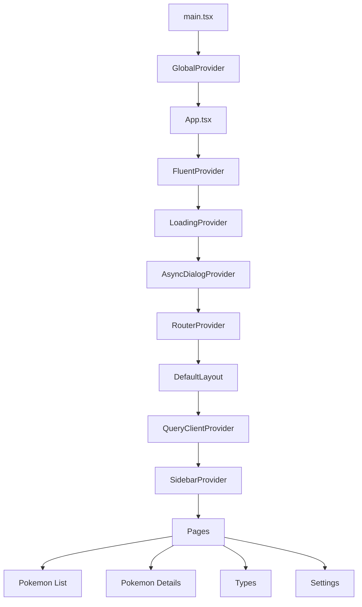

#### Overview

This project is a Vite + React + TypeScript single-page application for browsing Pokémon data provided by an ASP.NET Core backend.

#### Why I built it

- Provide a responsive Pokédex UI on top of the backend API
- Explore modern React patterns with TypeScript
- Combine Fluent UI components with Tailwind CSS utilities

#### Architecture

The application is organized around route pages, reusable UI components, helper utilities, and focused provider modules.

#### Current features

##### Implemented

- Pokémon listing page with client-side filtering
- Virtualized grid rendering for large Pokémon lists
- Pokémon details page with:
  - basic info
  - stats
  - evolution chain and variants
  - type effectiveness
  - in-game encounter data
  - previous/next navigation
- Global loading overlay with optional progress state
- Async dialog/message system for alerts and confirmations
- Theme switching: light, dark, system
- Language switching: English, Japanese, Vietnamese
- Responsive sidebar layout

##### Partial / in progress

- Type list and type detail pages are routed but still use placeholder screens
- Localization infrastructure is in place, but much of the Pokémon UI text is still hardcoded in English

#### Tech stack used

- React
- TypeScript
- Vite
- Fluent UI
- Tailwind CSS
- TanStack React Query
- i18next
- ASP.NET Core
- SQLite

#### Github repo

[https://github.com/truongvo31/PokedexWeb](https://github.com/truongvo31/PokedexWeb)

#### Live preview

[https://truongvo31.github.io/PokedexWeb/](https://truongvo31.github.io/PokedexWeb/)
