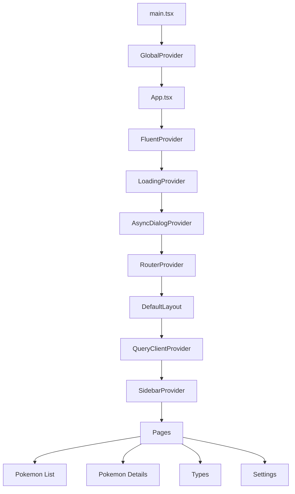

#### 概要

このプロジェクトは、ASP.NET Core バックエンドが提供するポケモンデータを閲覧するための、Vite、React、TypeScript で構築したシングルページアプリケーションです。

#### 開発した理由

- バックエンド API を利用したレスポンシブなポケモン図鑑 UI を提供するため
- TypeScript を使った現代的な React の設計パターンを学び、実践するため
- Fluent UI コンポーネントと Tailwind CSS のユーティリティを組み合わせるため

#### アーキテクチャ

アプリケーションは、ルートページ、再利用可能な UI コンポーネント、ヘルパーユーティリティ、役割ごとに整理したプロバイダーモジュールを中心に構成されています。

#### 現在の機能

##### 実装済み

- クライアント側フィルターに対応したポケモン一覧ページ
- 大量のポケモン一覧を効率的に表示する仮想化グリッド
- ポケモン詳細ページ:
  - 基本情報
  - ステータス
  - 進化系統とすがた違い
  - タイプ相性
  - ゲーム内での出現情報
  - 前後のポケモンへのナビゲーション
- 進捗状態にも対応したグローバルローディングオーバーレイ
- アラートや確認に対応した非同期ダイアログ・メッセージシステム
- ライト、ダーク、システム連動のテーマ切り替え
- 英語・日本語・ベトナム語の言語切り替え
- レスポンシブなサイドバーレイアウト

##### 一部実装・開発中

- タイプ一覧ページとタイプ詳細ページはルーティング済みですが、現在はプレースホルダー画面です
- 多言語化の基盤は整っていますが、ポケモン UI の多くのテキストはまだ英語でハードコードされています

#### 使用技術

- React
- TypeScript
- Vite
- Fluent UI
- Tailwind CSS
- TanStack React Query
- i18next
- ASP.NET Core
- SQLite

#### Github リポジトリ

[https://github.com/truongvo31/PokedexWeb](https://github.com/truongvo31/PokedexWeb)

#### ライブプレビュー

[https://truongvo31.github.io/PokedexWeb/](https://truongvo31.github.io/PokedexWeb/)
