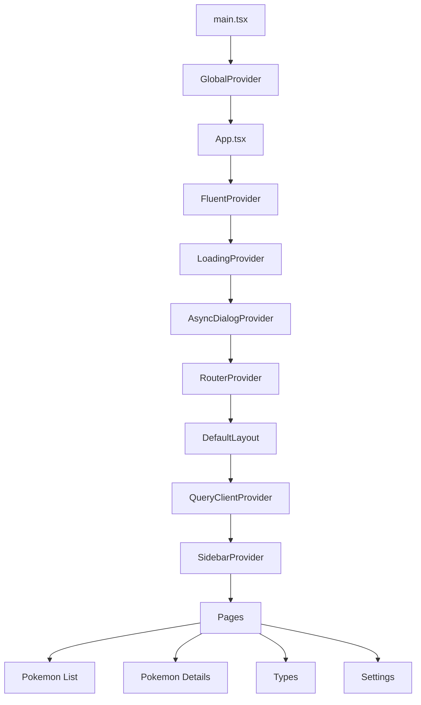

#### Tổng quan

Đây là một ứng dụng single-page được xây dựng bằng Vite, React và TypeScript để xem dữ liệu Pokemon do backend ASP.NET Core cung cấp.

#### Lý do xây dựng

- Xây dựng giao diện Pokédex responsive sử dụng backend API
- Tìm hiểu và áp dụng các cách tiếp cận hiện đại trong React với TypeScript
- Kết hợp các component của Fluent UI với các tiện ích của Tailwind CSS

#### Kiến trúc

Ứng dụng được tổ chức xoay quanh các trang theo route, các component UI có thể tái sử dụng, các helper utility và những module provider tập trung theo từng trách nhiệm.

#### Tính năng hiện tại

##### Đã triển khai

- Trang danh sách Pokemon với chức năng lọc phía client
- Hiển thị grid được virtualize để xử lý danh sách Pokemon lớn
- Trang chi tiết Pokemon với:
  - thông tin cơ bản
  - chỉ số
  - chuỗi tiến hóa và các biến thể
  - hiệu quả giữa các hệ
  - thông tin địa điểm gặp Pokemon trong game
  - điều hướng đến Pokemon trước và sau
- Global loading overlay có hỗ trợ hiển thị tiến trình
- Hệ thống dialog và message bất đồng bộ cho cảnh báo và xác nhận
- Chuyển đổi giao diện: sáng, tối và theo hệ thống
- Chuyển đổi ngôn ngữ: Tiếng Anh, Tiếng Nhật và Tiếng Việt
- Layout sidebar responsive

##### Đang hoàn thiện

- Các trang danh sách hệ và chi tiết hệ đã được định tuyến nhưng hiện vẫn đang sử dụng màn hình placeholder
- Hạ tầng đa ngôn ngữ đã có, nhưng phần lớn nội dung chữ trong UI Pokemon vẫn đang được hardcode bằng tiếng Anh

#### Công nghệ sử dụng

- React
- TypeScript
- Vite
- Fluent UI
- Tailwind CSS
- TanStack React Query
- i18next
- ASP.NET Core
- SQLite

#### Github repo

[https://github.com/truongvo31/PokedexWeb](https://github.com/truongvo31/PokedexWeb)

#### Bản xem trước trực tiếp

[https://truongvo31.github.io/PokedexWeb/](https://truongvo31.github.io/PokedexWeb/)
