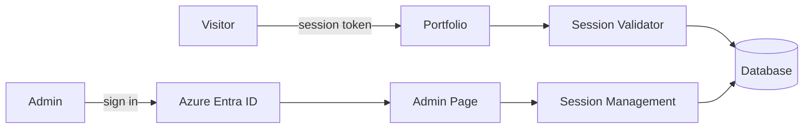

#### Overview

A multilingual personal portfolio built with React, TypeScript, Vite, and Fluent UI. It gives visitors a quick overview of who I am and what I can do, backed by a session-protected public site and an Azure AD-protected admin area for managing visitor access.

#### Why I built it

- Give recruiters and visitors a fast, visual overview of my background, skills, and work history
- Show hands-on experience designing and shipping a full application, not just listing projects

#### Why session-based auth

- **The pain**: publishing to GitHub Pages requires the repository to be public, so anyone could view the source and any personal information embedded in it
- **The countermeasure**: a session-token based authentication layer that limits who can actually view the portfolio content
- **The method**: an admin page for managing visitor sessions, backed by an ASP.NET Core API and secured with Azure Entra ID for administrator sign-in

#### Architecture

#### Features

- Responsive home page with introduction, work history, skills, and education
- Session-token validation for public routes
- Azure AD authentication for administrator routes
- Admin session management: create, edit, copy visitor URLs, revoke, and remove expired sessions
- English, Japanese, and Vietnamese translations
- Light, dark, and system theme modes

#### Tech stack used

- React
- TypeScript
- Vite
- Fluent UI
- Tailwind CSS
- TanStack React Query
- i18next
- MSAL / Azure Entra ID
- ASP.NET Core

#### Github repo

[github.com/truongvo31/Portfolio](https://github.com/truongvo31/Portfolio)
