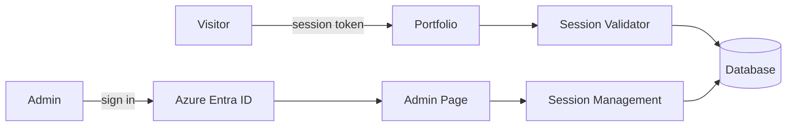

#### 概要

React、TypeScript、Vite、Fluent UI で構築した多言語対応の個人ポートフォリオです。訪問者に私自身の経歴やスキルを素早く伝えることを目的とし、セッションで保護された公開サイトと、Azure AD で保護された訪問者セッション管理用の管理画面で構成されています。

#### 開発した理由

- 採用担当者や訪問者に、私の経歴・スキル・職務経歴を短時間で視覚的に伝えるため
- 単にプロジェクトを羅列するのではなく、実際にアプリケーションを設計・実装した経験を示すため

#### セッションベース認証を導入した理由

- **課題**: GitHub Pages で公開するにはリポジトリを公開する必要があり、ソースコードや個人情報が誰にでも閲覧できてしまう
- **対策**: セッショントークンによる認証層を導入し、ポートフォリオの内容を閲覧できる相手を制限する
- **実装方法**: 訪問者セッションを管理する管理画面を用意し、ASP.NET Core 製の API と Azure Entra ID による管理者向け認証で保護する

#### アーキテクチャ

#### 主な機能

- 自己紹介、職務経歴、スキル、学歴を掲載したレスポンシブなホームページ
- 公開ページ向けのセッショントークン検証
- 管理者向けの Azure AD 認証
- 管理画面でのセッション管理(作成、編集、訪問者用 URL のコピー、失効、期限切れセッションの削除)
- 英語・日本語・ベトナム語の多言語対応
- ライト、ダーク、システム連動のテーマ切り替え

#### 使用技術

- React
- TypeScript
- Vite
- Fluent UI
- Tailwind CSS
- TanStack React Query
- i18next
- MSAL / Azure Entra ID
- ASP.NET Core

#### Github リポジトリ

[github.com/truongvo31/Portfolio](https://github.com/truongvo31/Portfolio)
