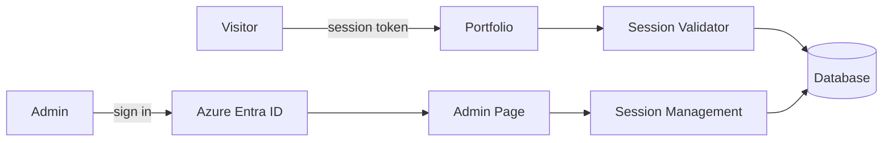

#### Tổng quan

Một trang portfolio cá nhân đa ngôn ngữ được xây dựng bằng React, TypeScript, Vite và Fluent UI. Trang giúp người xem nhanh chóng nắm được tổng quan về bản thân tôi cũng như những gì tôi có thể làm, được bảo vệ bởi cơ chế xác thực theo phiên (session) cho trang công khai và khu vực quản trị được bảo vệ bằng Azure AD để quản lý phiên truy cập của khách.

#### Lý do xây dựng

- Giúp nhà tuyển dụng và người xem có cái nhìn nhanh, trực quan về kinh nghiệm, kỹ năng và quá trình làm việc của tôi
- Thể hiện kinh nghiệm thực tế trong việc thiết kế và triển khai một ứng dụng hoàn chỉnh, thay vì chỉ liệt kê các dự án

#### Lý do sử dụng xác thực theo phiên (session-based auth)

- **Vấn đề**: để publish lên GitHub Pages, repository bắt buộc phải để public, đồng nghĩa với việc bất kỳ ai cũng có thể xem source code cũng như thông tin cá nhân chứa trong đó
- **Giải pháp**: xây dựng một lớp xác thực dựa trên session token để giới hạn ai có thể xem được nội dung portfolio
- **Cách triển khai**: xây dựng trang quản trị để quản lý session của khách truy cập, sử dụng backend ASP.NET Core và xác thực quản trị viên thông qua Azure Entra ID

#### Kiến trúc

#### Tính năng

- Trang chủ responsive với phần giới thiệu, quá trình làm việc, kỹ năng và học vấn
- Xác thực session token cho các route công khai
- Xác thực Azure AD cho các route quản trị
- Quản lý session tại trang quản trị: tạo, chỉnh sửa, sao chép URL cho khách, thu hồi và xóa các session đã hết hạn
- Hỗ trợ đa ngôn ngữ: Tiếng Anh, Tiếng Nhật và Tiếng Việt
- Chế độ giao diện sáng, tối và theo hệ thống

#### Công nghệ sử dụng

- React
- TypeScript
- Vite
- Fluent UI
- Tailwind CSS
- TanStack React Query
- i18next
- MSAL / Azure Entra ID
- ASP.NET Core

#### Github repo

[https://github.com/truongvo31/Portfolio](https://github.com/truongvo31/Portfolio)

#### Live preview

Chính trang này
